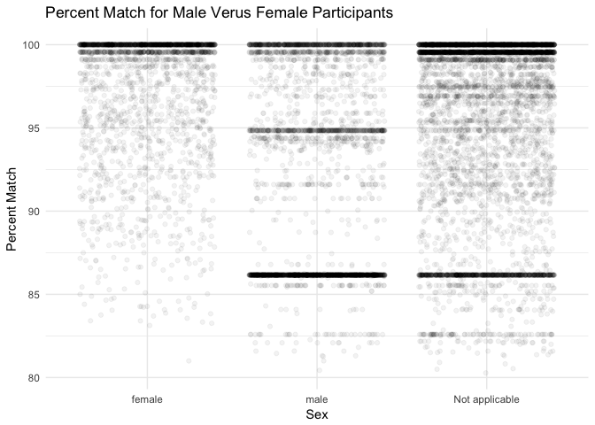

Analysis of BLAST Results
================
Katelyn B. Kukar
October 6, 2017

Introduction
============

Creating alternative ways of identification is highly important within the field of Forensics because this would allow for more specific analysis of potential suspects. By being able to compare blood, fingerprints, and other means of testing methods allows for a higher level of statistical significance for true suspect identification. Creating alternative methods is also important since some investigations of suspects of interest lack both DNA evidence and individual fingerprints allowing for ambiguity that could be resolved via other testing means. In Fierer et al., scientists explain that bacteria colonized on individual hands represent highly specific and diverse communities. They believe that "because skin bacterial communities are personalized, \[they\] could use the residual skin bacteria left on objects for forensic identification, matching the bacteria on the object to the skin-associated bacteria of the individual who touched the object," (Fierer et al.).

Within this study we analyze data collected from the Fierer Lab in Colorado through sequencing and computational techniques. The information gathered from the sequencing sets will be evaluated to further evidence towards the validity of utilizing such methods within forensic analysis. Specifically this analysis will utilize prior knowledge geared towards differences between the male and female sex. We hypothesize the female sex will have significantly different data than that of the male sex due to physiological and behavioral differences. Certain assumptions for this hypothesis include males having traditionally different hand shape and size, body hair, and fat percentage which constitute physiological differences. Assumptions of behavior for these differences are based on hygiene patterns experienced by males and females due to cultural biases towards the feminine construct.

Methods
=======

Sample origin, sequencing and computational techniques were utilized to analyze sequencing sets collected from human participants and their coinciding bacterial sequences from taken samples.

Sample origin and sequencing
----------------------------

#### Sample Collection

All analysis was done using Fierer et al. as a reference source for sequence data and sample origins. Within the paper it is stated that samples were taken from nine healthy adults (four female, five male) who worked within the same building at the University of Colorado between ages 18-40. The samples taken included computer mouse swabs touched by the owner 12h before swabbing and the palm of the individual's dominant hand used to operate the mouse. Individuals were required to maintain normal hygiene habits prior to the swab as to not increase variation. The swabs were taken using autoclave cotton-tipped swabs that were autoclave and pre-moistened with a sterile solution. The swabbing took place for 10s per sample taken with all samples being kept at -80C for less than a week before DNA extraction (Fierer et al).

#### DNA Extraction and Pyrosequencing

Fierer et al. explains that for each sample the 16s rRNA genes were amplified using the MO BIO PowerSoil DNA Isolation kit with the broken, frozen cotton swabs. These tubes were then horizontally shaken and kit procedures were followed for extraction. PCR reactions were carried out in triplicate repeats using HotMAsterMic with thermal cycling at 94C for 3min followed by 35 cycles of denaturation, annealing for 30s, and extension and final extension procedures. Replicate amplicons were pooled in agarose gel using SYBR Safe DNA gel stain from Invitrogen. Amplicon DNA concentrations were then measured with the final pool of DNA being precipitated, centrifuged, and centrifuged to create a pellet that was re-suspended in nuclease-free water. Pyrosequencing was then carried out on a 454 Life Sciences Genome Sequencer FLX instrument at the University of South Carolina (Fierer et al).

Computational
-------------

In order to analyze the sequences received we used computational programs to evaluate variables of interest. The variables we want to analyze more specifically include participant sex and commonly found bacterial community strains within the metadata set.

To create a meta data set with all of the vectors of interest we initially utilized the raw data sets collected from the 454 Sequencer and published by Fierer et al. This was done using a remote server and fastq-dump to download the list of files in the run table to the raw directory. QC reports were then created for each of the runs utilizing fastqc and outputted as HTML to be readable. The fastqc files were trimmed (Trimmomatic Tool) based on their quality scores to discard sequences under 150 base pairs and cut off reads when the base score drops below 25. Fastqc files were then converted to fasta files to be used as BLAST queries (Bioawk). These files were then run against NCBI database (nt), using BLAST (blastn) to output csv file which was based on the name output and included all of the sequence data, plus the bacterial communities each sequence matched to with their quality scores and additional information.

Then the Blast results were further formatted to create an output dataframe with proper column headers that denote each variable of interest from the results (qseqid). After this, the query sequence ID was split into Sample and Number components to group the files into columns (tidyr and separate) to make a vector of all the BLAST output file names, including the names of the directories. An empty matrix was created to join the data back and read in the meta data (rbind).

We than use dplyr piping syntax to select a subset of row matching each vector we want to filter (categorically) and pipe out (numerically) to create histograms. We also used ggplot syntax as a comparative feature to plot multiple categorical variables against one another using one primary numerical variable. Tables were created with kable to tabularize quantified data sets and visualize the most common bacterial communities found for singular categorical vectors (males and females).

Results
=======

The results section was primarily used to extrapolate data in regards to female participants and the specific bacterial communities identified. This section outlines statistical analyses used to filter through the data set to identify the specific bacterial communities and where they arose against male counterparts.

    ## Warning: package 'dplyr' was built under R version 3.4.2

### Extrapolating Human Female Data from Meta Data

The data first needed to be filtered by human genomic data which was done though the extrapolation of "Sebum," utilizing the percent identification for each sequence.

**Figure 1a.** Histogram of Percent Identity of Human Environmental Material within Whole Data

Once primarily human genomic data was extrapolated, only the female data was further filtered out utilizing the percent identification for each sequence

**Figure 1b.** Histogram of Percent Identity of Human Environmental Material Analyzed for Females

The data next needed to be filtered by human genomic data which was done though the extrapolation of "Sebum," utilizing the sequence length for each sequence as a secondary check against percent identity matches. These two characters were constantly used to analyze the data throughout the experiment.

**Figure 2a.** Histogram of Query Sequence Length of Human Environmental Material within Whole Data

Once primarily human genomic data was extrapolated, only the female data was further filtered out utilizing the sequence length for each sequence.

**Figure 2b.** Histogram of Query Sequence Length of Human Environmental Material Analyzed for Females

### Identifying Specific Bacterial Colonies for Females

Once the data had been filtered by both sequence length and percent identity match, to visualize potential skews and data discrepancies, a further analyses was done to quantify the amount of specific bacterial colonies seen on female participant samples.

**Table 1** Most Common Bacterial Communities visualized within Female Participants

| Scientific Names       |  Count|
|:-----------------------|------:|
| Bartonella washoensis  |    678|
| Acidovorax sp.         |    173|
| unidentified bacterium |     85|
| Lupinus angustiflorus  |     76|
| Methylophilus quaylei  |     55|

**Figure 3** Bar Graph of Most Common Bacterial Communities visualized within Female Participants

After the most common bacterial species was identified for the sex of interest analysis of the data was done through a histogram to visualize the frequency of this specific bacterial community, in regards to percent identity and base pair length within the sequences.

**Figure 4a.** Histogram for Percent Identity of Human Environmental Material Analyzed for Females for Most Common Bacterial Community Found

**Figure 4b.** Histogram for Query Sequence Length of Human Environmental Material Analyzed for Females for Most Common Community Found

###### Identifying Specific Bacterial Colonies for Males

After female analyses were run it was concluded that a potential difference could be present between the sexes due to behavioral and physiological traits. To further investigate these differences within sex analyses were continued on male participant data using the most common bacterial species.

**Table 2** Most Common Bacterial Communities visualized within Male Participants

| Scientific Names                   |  Count|
|:-----------------------------------|------:|
| Solemya pervernicosa gill symbiont |   1549|
| Aquitalea sp. KJ011                |    500|
| Acidovorax sp.                     |    170|
| Pinus oocarpa                      |    127|
| Acinetobacter junii                |    117|

**Figure 5.** Bar Graph of Most Common Bacterial Communities visualized within Male Participants

After the most common bacterial species was identified for the sex of interest analysis of the data was done through a histogram to visualize the frequency of this specific bacterial community, in regards to percent identity and base pair length within the sequences. This was done specifically for the male population due to the visualization of differing bacterial communities from the female specific analyses done prior.

**Figure 6a.** Histogram of Percent Identity of Human Environmental Material Analyzed for Males for Most Common Community Found

**Figure 6b.** Histogram of Query Sequence Length of Human Environmental Material Analyzed for Males for Most Common Community Found

After both male and female data sets were individually analyzed comparative measures were taken to showcase differences in percent identity and sequence lengths overall. In this way sex specific interpretations could be made towards bacterial communities visualized based on original sequence data received.

**Figure 7a.** Percent Match for Male Versus Female Participants

**Figure 7b.** Length of Sequences for Male versus Female Participants

Discussion
==========

#### Females

Utilizing R as a tool to create our graphics for statistical analysis of the sequence data we were able to extrapolate multiple histograms that depicted skews related to percent identity and sequence length in female participants. We were able to extrapolate only human samples from the data set by looking for "sebum" samples, these samples represent a common human skin oil which is unlike the dust sampled from the electronics. For percent identity of the specific sequences found the histogram represented a majority of the sequences residing in the 98-100 percent identity match range. We can conclude that for Female samples the sequences were more specific. To create a secondary check for the goodness of the sequence data we also looked at sequence length to see if any short sequences potentially created dependencies during blast analysis. The histogram depicted a skew with the majority of sequences between 220-240 base pairs. However marginal outliers did exist. We can rationalize these sequence lengths because a majority of sequencing platforms can only sequence a maximum read length of 240 base pairs. We finally filtered out the female participants in regard to the scientific name of the species and count the most common bacterial communities in order to divulge the most common species found was **Bartonella washoensis**. **Bartonella washonesis** is commonly found as a cause for meningitis. Potentially the female participants were more susceptible to meningitis due to their proximity of work (in the same building) or from exposure to mites from animals located at the University of Colorado, a naturally "outdoors" oriented campus. This specific data was analyzed further to find the average percent match for **Bartonella washoensis** was between 99-100 percent, and sequence length in base pairs was between 220-230. Both of these numbers give us evidence towards the fact that this is an indisputable found.

#### Males

Once female data was compiled male participants were also analyzed to find **Solemya pervernicosa gill symbiont** as the primary bacterial colony for male only samples. This bacterial community resides in the taxa of sulfur-oxidizing symbionts. This means this bacteria usually requires a host environment, where in which, it's cohabitation benefits the host. The sulfur-oxidizing symbionts tend to inhabit marine hosts, much as the classification **Soleyma pervernicosa** defines. **Soleyma pervernicosa** is a small bivalve, salt-water clam that resides in shallow marine habitats. Concluding that the sulfur-oxidizing feature of this symbiont is to give nutrition to the bivalve since it naturally lacks a digestive system. Then when the most common bacterial community was graphed as a histogram it was found the percent identity was only between 86-87 percent, very unlike the percent of the female. The histogram for sequence was only found to be under 160 base pair lengths. This information is incredibly concerning since both the percent identity and base pair lengths are far lower. We can conclude this sequence data could be inconclusive because of too little DNA, an unable to be sequenced region, a "dirty" template, sample contamination, or other issues. This should be re-sequenced or lab notebook notes should be reevaluated for error.
